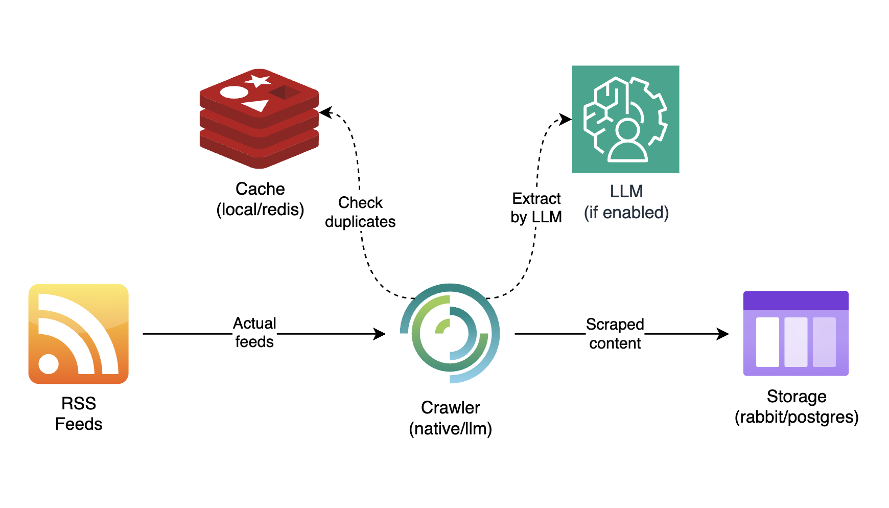

# News-RSS Project

## Overview

The News-RSS project is a sophisticated tool designed to scrape and parse RSS feeds, leveraging the power of 
Large Language Models (LLMs) to extract valuable artifacts from articles. This includes information such as 
content placement, publication dates, author names, and other useful attributes.



There is a part of crawler platform that collect's scrapped news to storage (postgres) or queue (rabbitmq)
with following pre-processing steps:

- Extract rss item with content and source URL of article;
  - Check source URL into cache - does article has been already parsed? 
  - If content is not empty replaced any trash tags from text content;
  - If content is empty send request to LLM to extract content from HTML document;
- Send extracted data to storage/queue. 

## Features

- RSS feed scraping and parsing
- LLM-powered content analysis
- Storing parsed data to storage/queue
- Docker-based deployment for easy setup and scalability
- Compile with feature to enable:
  - native/llm crawler;
  - local/redis caching;
  - rabbitmq/postgres storage.

## Quick Start

1. Clone the repository:

    ```shell
    git clone http://<gitlab-domain-address>/data-lake/news-rss.git
    cd news-rss
    ```

2. Build docker image from sources with passed features:

    To build with default features (local caching, native crawler, rabbitmq):
    ```shell
   docker build -t new-rss:latest .
    ```
   
    To build with features add parameter `--build-arg FEATURES='--features cache-redis'`
    
    For example to build with redis and llm crawler use this command:
    ```shell
   docker build --build-arg FEATURES='--features cache-redis --feature crawler-llm' -t new-rss:latest .
    ```
   
    There are following available features:
      - `cache-redis` Use remote redis cache service; 
      - `publish-offline` Store scraped and parsed feeds content to `postgres` instead `rabbitmq`;
      - `crawler-llm` Use llm to scrape and parse html data of source article instead `native crawler`.

3. Edit or create a new `.env` file in the project root and add your configuration:

    ```dotenv
    POSTGRES_USER=postgres
    POSTGRES_PASSWORD=postgres

    REDIS_USERNAME=redis
    REDIS_PASSWORD=redis
    REDIS_USER_PASSWORD=redis
    ```
   
4. Edit configs file `config/production.toml` to launch docker compose services:

    The main parameter into `topics.rss.target_url` - you may pass multiple rss URL sources by column like this
    `target_url=https://feeds.feedburner.com/ndtvnews-world-news,https://feeds.skynews.com/feeds/rss/world.xml`

5. Start the application using Docker Compose:
    
    ```shell
    docker compose --env-file .env up -d news-rss <other-needed-services>
    ```
   
    Into `<other-needed-services>` pass services names needed for current features. 
    For example if you build project docker image with default features you have not to use postgres and redis services.

6. The application should now be running. Check the logs with:

    ```shell
    docker compose logs -f
    ```
